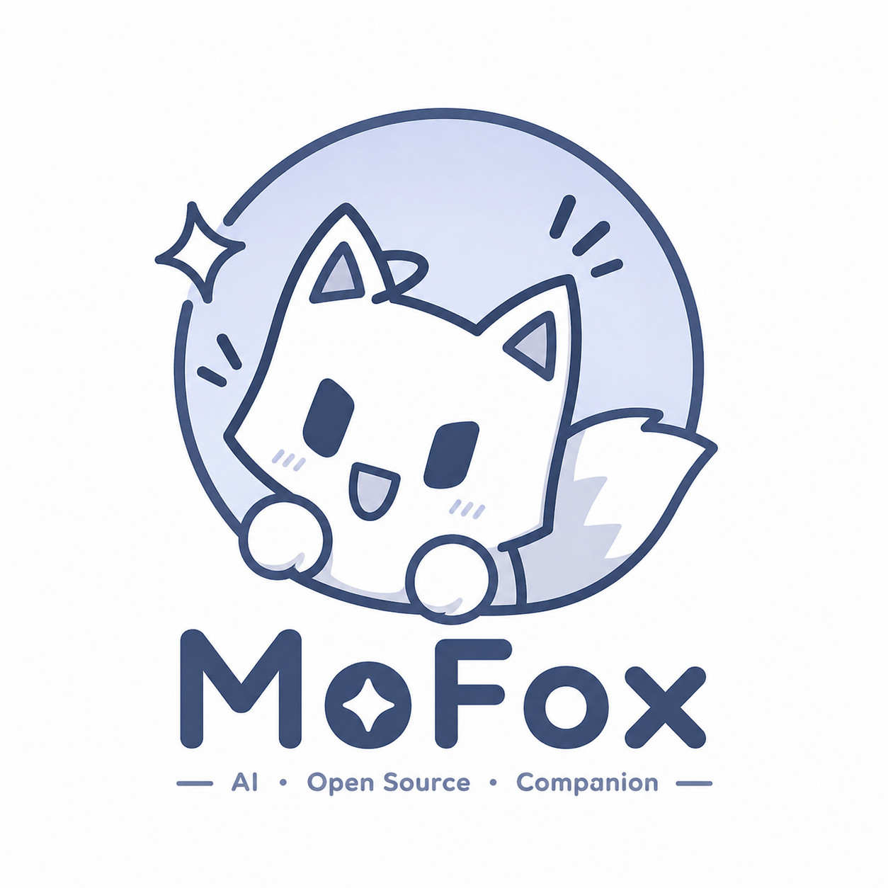



  

<h1 align="center">Neo-MoFox 🦊</h1>

  <b>下一代高度弹性的 AI 数字生命体引擎</b> 
  不只是聊天机器人，而是真正属于你的 AI 伙伴

  
  

---

## 🌟 什么是 Neo-MoFox？

Neo-MoFox 是一个全新重构的 AI 聊天机器人框架，它的目标不仅仅是回答问题，而是为你构筑一个真正的**数字生命体**。我们在架构设计上注入了极高的灵活性，使得这个框架不仅具备情感与记忆机制，还可以完美贴合任何自定义场景的需求。

无论你想要打造一个温馨的二次元管家、一个强力的社群运营助手，还是一个具备专属工作流的 AI 协作者，Neo-MoFox 都能成为最坚实的基石。

---

## ✨ 框架特性

### 🧩 灵活强大的插件系统
- **万物皆组件**：指令、工具、动作、消息适配器均采用组件化设计。
- **免重启热加载**：支持在运行时动态挂载、应用与卸载功能，告别反复重启的繁琐。
- **无缝集成**：可自由拓展以对接不同的大模型或外部工具。

### ⚙️ 极度可自定义能力
- **弹性配置**：行为模式、LLM 后端、长短期记忆逻辑等均可层层定义。
- **丰富的底层能力 (Kernel)**：提供数据库、向量库、定时任务调度器及内存/磁盘缓存接口。
- **完善的事件总线**：全面覆盖生命周期、会话节点及系统底层的事件监听，让插件掌控全局。

### 🧠 进阶心智与深度记忆
- 智能整理、提取并持久化对话历史，建立独特的人物画像与相处模式。
- 非结构化情感识别和记忆归档功能，赋予 AI 真情实感。

### 🌐 跨平台流式交互
- 原生支持多个消息平台的标准化接入。
- 一次编写，到处运行：统一的消息类型结构化分发，一套插件通吃 QQ、Discord 等社群适配器。

---

## 🚀 部署指南

我们提供了多种部署途径，供您因地制宜地组装数字伙伴系统。

### 🔌 启动器部署（推荐）
可视化、无代码的操作方式，小白和进阶用户均可快速跑通：
- **项目仓库及下载地址**：[Neo-MoFox-Launcher](https://github.com/MoFox-Studio/Neo-MoFox-Launcher)

### 💻 命令行部署
对于想要一窥源码、深度定制的开发者：
1. 克隆或拉取本仓库。
2. 初始化环境：使用 uv run main.py 首次运行，完成必要组件生成。
3. 修改配置：打开 config/core.toml 和 config/model.toml 编辑相关设置及鉴权信息。
4. 启动引擎：再次运行 uv run main.py 唤醒引擎。

> **💡 WebUI 安装提示**  
> 如果您采用命令行部署，框架本体不包含可视化的后台。需要手动安装对应的 Web 控制面板：  
> [MoFox-Core-Webui](https://github.com/MoFox-Studio/MoFox-Core-Webui)

---

## 🧭 联系我们

获取最新资源、探索高阶用法或结识同频开发者，请加入我们的社区：

- 📚 **官方文档**：[https://docs.mofox-sama.com/](https://docs.mofox-sama.com/)
- 🐧 **用户QQ群**：169850076
- 🎧 **KOOK 频道**：[https://kook.vip/NmrFgn](https://kook.vip/NmrFgn)

---

## 📄 开源协议

本项目采用 [AGPL-3.0](LICENSE) 协议开源。

  <b>用心创造，用爱陪伴 ❤️</b> 
  如果这个项目对你有帮助，欢迎点亮一长排 ⭐ Star！

